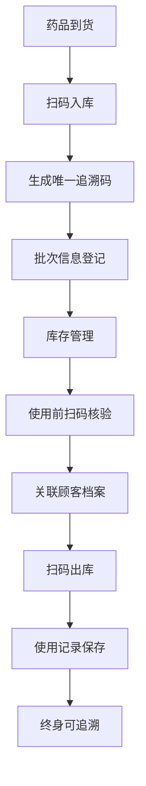

## 1. 产品概述

医美诊所管理平台是一套专为医疗美容机构设计的全流程数字化管理系统，涵盖顾客咨询、手术管理、术后恢复、药品耗材溯源等核心业务环节。系统旨在提升医美机构的运营效率，规范医疗操作流程，保障顾客安全与隐私，实现医疗数据的可追溯管理。

- 核心价值：通过数字化手段实现医美业务全流程闭环管理，提升医疗质量和服务水平
- 目标用户：医美诊所的咨询师、医生、护士、管理员等不同角色工作人员
- 解决问题：传统医美管理存在的信息孤岛、流程不规范、数据追溯难、隐私保护弱等痛点

## 2. 核心功能

### 2.1 用户角色

| 角色 | 注册方式 | 核心权限 |
|------|----------|----------|
| 管理员 | 后台创建 | 系统配置、用户管理、权限分配、数据统计、所有模块查看 |
| 咨询师 | 管理员创建 | 顾客咨询登记、沟通纪要记录、术前照片上传、顾客档案查看 |
| 医生 | 管理员创建 | 手术信息录入、电子知情同意书签署、术后回访、并发症记录 |
| 护士 | 管理员创建 | 药品出入库、耗材管理、术后护理记录、复查拍照 |

### 2.2 功能模块

1. **数据仪表盘**：业务概览、关键指标统计、数据可视化图表
2. **顾客咨询管理**：咨询登记表、沟通纪要、术前照片管理
3. **手术项目管理**：电子知情同意书、手术信息录入、假体耗材追溯
4. **术后恢复管理**：回访记录、并发症管理、术前术后照片对比
5. **药品针剂管理**：扫码出入库、一物一码溯源、批次管理
6. **系统管理**：用户管理、角色权限、系统配置

### 2.3 页面详情

| 页面名称 | 模块名称 | 功能描述 |
|---------|----------|----------|
| 登录页 | 身份认证 | 账号密码登录、角色识别、权限校验 |
| 仪表盘 | 数据概览 | 今日预约数、手术量、咨询量、收入统计、趋势图表 |
| 顾客列表 | 顾客管理 | 顾客档案列表、搜索筛选、新增/编辑顾客 |
| 咨询登记 | 咨询管理 | 改善部位选择、预算范围、过往医美史、富文本纪要 |
| 术前照片 | 照片管理 | 三个角度强制上传、照片预览、在线裁剪 |
| 手术管理 | 手术模块 | 手术信息录入、麻醉方式选择、术者信息 |
| 知情同意书 | 电子签名 | 同意书模板、电子签名采集、签名保存验证 |
| 耗材管理 | 假体耗材 | 品牌批号有效期录入、植入类耗材强制关联顾客 |
| 术后回访 | 恢复管理 | 回访日期、红肿疼痛淤青评估、拆线日期记录 |
| 并发症记录 | 不良事件 | 并发症描述、分类标记、处理措施记录 |
| 照片对比 | 前后对比 | 同角度术前术后照片并排对比、缩放查看 |
| 药品管理 | 针剂溯源 | 扫码入库出库、批次管理、一物一码追溯 |
| 用户管理 | 系统设置 | 用户增删改查、角色分配、密码重置 |
| 权限配置 | 系统设置 | 角色权限定义、菜单权限、操作权限配置 |

## 3. 核心流程

### 3.1 顾客咨询到手术流程

顾客到店后，咨询师首先登记咨询信息，记录顾客想改善的部位、预算范围和过往医美史。上传正面、侧面45°、侧面90°三个角度的术前照片并进行裁剪。咨询师与顾客沟通后记录沟通纪要，生成咨询档案。

若顾客确定手术，医生创建手术项目，填写手术日期、术者信息、麻醉方式和手术名称。顾客签署电子知情同意书并采集电子签名。手术中使用的假体/耗材录入系统，植入类耗材强制关联顾客档案形成终身追溯。

术后护士定期回访，记录恢复情况评估（红肿/疼痛/淤青级别）和拆线日期。如出现并发症，详细记录并分类标记。复查时拍摄同角度照片，与术前照片并排对比查看恢复效果。

### 3.2 药品针剂管理流程

## 4. 用户界面设计

### 4.1 设计风格

- **主色调**：玫瑰粉 (#F8B4D9) - 传递医美行业的柔美与专业感
- **辅助色**：医疗蓝 (#4A90D9) - 体现医疗行业的专业与可信赖
- **强调色**：金色 (#D4AF37) - 用于关键操作按钮，体现高端品质感
- **中性色**：米白 (#FAFAF8)、浅灰 (#F5F5F5)、深灰 (#333333)
- **按钮风格**：圆角 8px，柔和阴影，悬停时有轻微缩放和渐变效果
- **字体**：标题使用 "Noto Serif SC" 衬线字体体现高端感，正文使用 "Noto Sans SC" 无衬线字体保证可读性
- **布局风格**：卡片式布局，柔和圆角，精致阴影，充足留白
- **图标风格**：线性图标，统一 24px 尺寸， stroke-width 1.5px

### 4.2 页面设计概述

| 页面名称 | 模块名称 | UI元素 |
|---------|----------|--------|
| 登录页 | 身份认证 | 品牌Logo展示、渐变背景、玻璃拟态登录卡片、优雅动画 |
| 仪表盘 | 数据概览 | 数据卡片网格、趋势折线图、饼图统计、今日待办列表 |
| 咨询登记 | 表单页面 | 分步表单、部位选择卡片、预算滑块、富文本编辑器 |
| 术前照片 | 上传页面 | 三栏照片上传区、拖拽上传、在线裁剪工具、预览弹窗 |
| 知情同意书 | 签署页面 | 文档预览区、手写签名板、签名确认动画 |
| 照片对比 | 对比页面 | 左右分栏对比、同步缩放、角度切换标签 |
| 药品管理 | 列表页面 | 扫码区域、药品卡片网格、追溯码详情弹窗 |

### 4.3 响应式设计

- 采用桌面优先设计原则，主断点 1440px、1024px、768px
- 侧边栏在平板设备自动收起为图标模式
- 表单在移动端自适应为单列布局
- 数据表格在小屏幕自动转换为卡片列表展示
- 触摸操作优化：触控区域最小 44x44px，滑动手势支持

### 4.4 视觉动效

- 页面加载时采用渐入 + 轻微上浮动画
- 卡片悬停时阴影加深 + 2px 上浮效果
- 表单提交成功时显示金色勾号动画
- 照片上传时显示进度条和缩略图预览
- 签名完成时显示笔刷轨迹动画
- 数据统计数字增长动画
