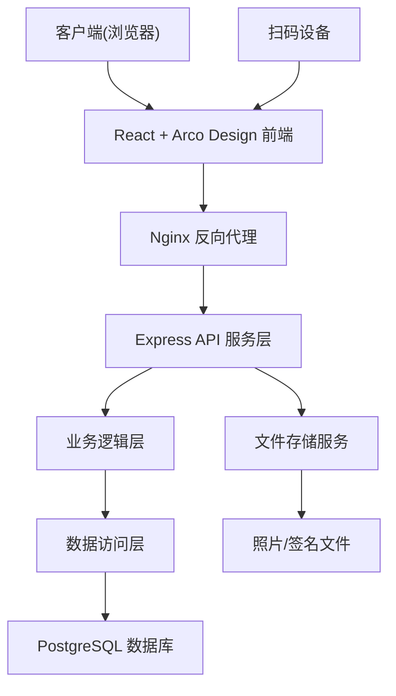
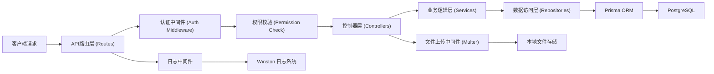
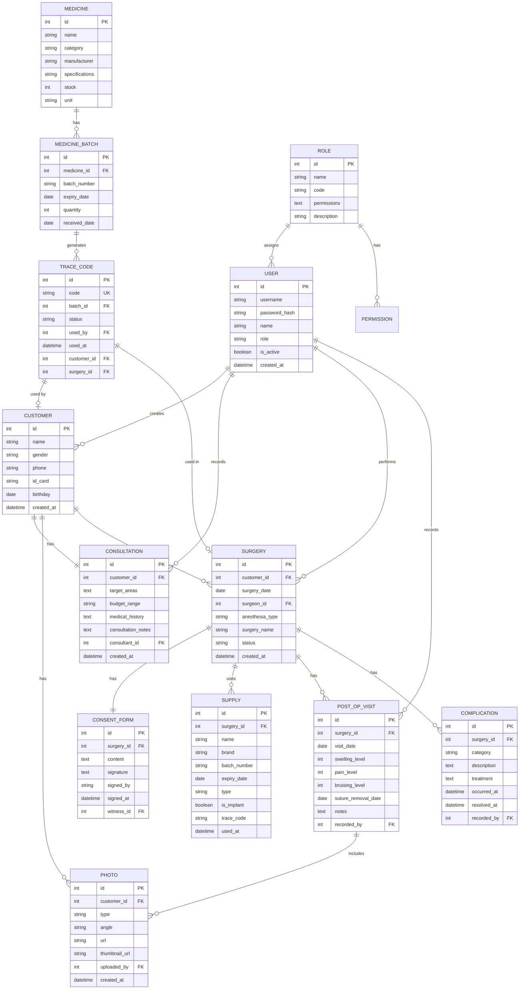

## 1. 架构设计



## 2. 技术描述

### 2.1 前端技术栈
- **框架**: React@18.2.0 + TypeScript@5.0
- **UI组件库**: @arco-design/web-react@2.60.0
- **构建工具**: Vite@5.0
- **路由管理**: react-router-dom@6.20
- **状态管理**: zustand@4.4
- **图表库**: @antv/g2@5.1 (数据可视化)
- **富文本编辑**: @arco-design/web-react + 自定义编辑器
- **图片裁剪**: react-image-crop@10.1
- **电子签名**: react-signature-canvas@1.0
- **HTTP客户端**: axios@1.6
- **样式方案**: Tailwind CSS@3.3 + CSS Variables
- **图标库**: lucide-react@0.294.0

### 2.2 后端技术栈
- **运行环境**: Node.js@18 LTS
- **Web框架**: Express@4.18
- **语言**: TypeScript@5.0
- **ORM框架**: Prisma@5.7
- **数据库**: PostgreSQL@15
- **认证方案**: JWT (JSON Web Token)
- **密码加密**: bcryptjs@2.4
- **文件上传**: multer@1.4
- **数据验证**: zod@3.22
- **日志**: winston@3.11

### 2.3 项目初始化
使用 `react-express-ts` 模板初始化项目，包含完整的前后端架构。

## 3. 路由定义

| 路由路径 | 页面/接口 | 权限要求 | 说明 |
|---------|----------|----------|------|
| `/login` | 登录页 | 公开 | 用户身份认证 |
| `/dashboard` | 数据仪表盘 | 所有登录用户 | 业务数据概览 |
| `/customers` | 顾客列表 | 咨询师/医生/管理员 | 顾客档案列表 |
| `/customers/new` | 新增顾客 | 咨询师/管理员 | 创建顾客档案 |
| `/customers/:id` | 顾客详情 | 咨询师/医生/管理员 | 查看顾客完整档案 |
| `/customers/:id/consultation` | 咨询登记 | 咨询师 | 填写咨询登记表 |
| `/customers/:id/photos` | 术前照片 | 咨询师/护士 | 上传管理术前照片 |
| `/surgeries` | 手术列表 | 医生/管理员 | 手术项目列表 |
| `/surgeries/new` | 新建手术 | 医生/管理员 | 创建手术项目 |
| `/surgeries/:id/consent` | 知情同意书 | 医生 | 电子签名签署 |
| `/surgeries/:id/supplies` | 耗材管理 | 医生/护士 | 假体耗材录入 |
| `/postoperative` | 术后管理 | 医生/护士 | 术后回访列表 |
| `/postoperative/:id/visit` | 回访记录 | 医生/护士 | 填写回访记录 |
| `/postoperative/:id/compare` | 照片对比 | 医生/护士 | 术前术后对比 |
| `/medicines` | 药品管理 | 护士/管理员 | 药品针剂列表 |
| `/medicines/scan` | 扫码出入库 | 护士/管理员 | 扫码操作 |
| `/medicines/trace/:code` | 溯源查询 | 所有登录用户 | 追溯码查询 |
| `/system/users` | 用户管理 | 管理员 | 用户账号管理 |
| `/system/roles` | 权限配置 | 管理员 | 角色权限管理 |

## 4. API 定义

### 4.1 认证接口

```typescript
// 登录请求
interface LoginRequest {
  username: string;
  password: string;
}

// 登录响应
interface LoginResponse {
  token: string;
  user: {
    id: number;
    username: string;
    name: string;
    role: 'admin' | 'consultant' | 'doctor' | 'nurse';
    avatar?: string;
  };
}

// POST /api/auth/login
// POST /api/auth/logout
// GET /api/auth/profile
```

### 4.2 顾客管理接口

```typescript
interface Customer {
  id: number;
  name: string;
  gender: 'male' | 'female';
  phone: string;
  idCard?: string;
  birthday?: Date;
  consultation?: Consultation;
  photos: Photo[];
  surgeries: Surgery[];
  createdAt: Date;
}

interface Consultation {
  id: number;
  customerId: number;
  targetAreas: string[]; // 面部/眼部/鼻部/胸部/吸脂/注射
  budgetRange: string;
  medicalHistory: string;
  consultationNotes: string; // 富文本
  consultantId: number;
  createdAt: Date;
}

interface Photo {
  id: number;
  customerId: number;
  type: 'front' | 'side45' | 'side90' | 'postoperative';
  angle?: 'front' | 'side45' | 'side90';
  url: string;
  thumbnailUrl: string;
  uploadedBy: number;
  createdAt: Date;
}

// GET /api/customers
// GET /api/customers/:id
// POST /api/customers
// PUT /api/customers/:id
// POST /api/customers/:id/consultation
// POST /api/customers/:id/photos
// DELETE /api/customers/:id/photos/:photoId
```

### 4.3 手术管理接口

```typescript
interface Surgery {
  id: number;
  customerId: number;
  surgeryDate: Date;
  surgeonId: number;
  anesthesiaType: 'local' | 'general';
  surgeryName: string;
  consentForm?: ConsentForm;
  supplies: Supply[];
  postOperativeVisits: PostOperativeVisit[];
  complications: Complication[];
  status: 'scheduled' | 'in_progress' | 'completed' | 'cancelled';
  createdAt: Date;
}

interface ConsentForm {
  id: number;
  surgeryId: number;
  content: string;
  signature?: string; // base64 签名图片
  signedBy?: string;
  signedAt?: Date;
  witnessId?: number;
}

interface Supply {
  id: number;
  surgeryId: number;
  name: string;
  brand: string;
  batchNumber: string;
  expiryDate: Date;
  type: 'implant' | 'consumable' | 'medicine';
  isImplant: boolean; // 植入类需强制关联顾客
  traceCode?: string;
  usedAt: Date;
}

// GET /api/surgeries
// GET /api/surgeries/:id
// POST /api/surgeries
// PUT /api/surgeries/:id
// POST /api/surgeries/:id/consent
// POST /api/surgeries/:id/supplies
// PUT /api/surgeries/:id/supplies/:supplyId
```

### 4.4 术后管理接口

```typescript
interface PostOperativeVisit {
  id: number;
  surgeryId: number;
  visitDate: Date;
  swellingLevel: 0 | 1 | 2 | 3; // 红肿级别 0-3
  painLevel: 0 | 1 | 2 | 3; // 疼痛级别 0-3
  bruisingLevel: 0 | 1 | 2 | 3; // 淤青级别 0-3
  sutureRemovalDate?: Date;
  notes: string;
  photos: Photo[];
  recordedBy: number;
}

interface Complication {
  id: number;
  surgeryId: number;
  category: string; // 并发症分类
  description: string;
  treatment: string;
  occurredAt: Date;
  resolvedAt?: Date;
  recordedBy: number;
}

// GET /api/postoperative
// POST /api/postoperative/:surgeryId/visit
// POST /api/postoperative/:surgeryId/complication
// GET /api/postoperative/compare?surgeryId=xxx
```

### 4.5 药品针剂管理接口

```typescript
interface Medicine {
  id: number;
  name: string;
  category: 'botulinum' | 'hyaluronic' | 'water_light' | 'other';
  manufacturer: string;
  specifications: string;
  stock: number;
  unit: string;
}

interface MedicineBatch {
  id: number;
  medicineId: number;
  batchNumber: string;
  expiryDate: Date;
  quantity: number;
  receivedDate: Date;
  traceCodes: TraceCode[];
}

interface TraceCode {
  id: number;
  code: string; // 唯一追溯码
  batchId: number;
  status: 'in_stock' | 'used' | 'expired';
  usedBy?: number;
  usedAt?: Date;
  customerId?: number; // 关联使用顾客
  surgeryId?: number;
}

// POST /api/medicines/scan/inbound - 扫码入库
// POST /api/medicines/scan/outbound - 扫码出库
// GET /api/medicines/trace/:code - 追溯查询
// GET /api/medicines/batches
// POST /api/medicines/batches
```

### 4.6 系统管理接口

```typescript
interface User {
  id: number;
  username: string;
  name: string;
  role: 'admin' | 'consultant' | 'doctor' | 'nurse';
  permissions: string[];
  isActive: boolean;
  createdAt: Date;
}

interface Role {
  id: number;
  name: string;
  code: string;
  permissions: string[];
  description: string;
}

// GET /api/users
// POST /api/users
// PUT /api/users/:id
// DELETE /api/users/:id
// GET /api/roles
// PUT /api/roles/:id/permissions
```

## 5. 服务器架构图



## 6. 数据模型

### 6.1 ER 图



### 6.2 DDL 语句

```sql
-- 角色表
CREATE TABLE roles (
    id SERIAL PRIMARY KEY,
    name VARCHAR(50) NOT NULL,
    code VARCHAR(50) UNIQUE NOT NULL,
    permissions TEXT[],
    description TEXT,
    created_at TIMESTAMP DEFAULT CURRENT_TIMESTAMP,
    updated_at TIMESTAMP DEFAULT CURRENT_TIMESTAMP
);

-- 用户表
CREATE TABLE users (
    id SERIAL PRIMARY KEY,
    username VARCHAR(50) UNIQUE NOT NULL,
    password_hash VARCHAR(255) NOT NULL,
    name VARCHAR(100) NOT NULL,
    role VARCHAR(20) NOT NULL CHECK (role IN ('admin', 'consultant', 'doctor', 'nurse')),
    role_id INTEGER REFERENCES roles(id),
    permissions TEXT[],
    is_active BOOLEAN DEFAULT TRUE,
    avatar_url VARCHAR(255),
    created_at TIMESTAMP DEFAULT CURRENT_TIMESTAMP,
    updated_at TIMESTAMP DEFAULT CURRENT_TIMESTAMP
);

-- 顾客表
CREATE TABLE customers (
    id SERIAL PRIMARY KEY,
    name VARCHAR(100) NOT NULL,
    gender VARCHAR(10) NOT NULL CHECK (gender IN ('male', 'female')),
    phone VARCHAR(20) NOT NULL,
    id_card VARCHAR(18),
    birthday DATE,
    contact_address TEXT,
    created_by INTEGER REFERENCES users(id),
    created_at TIMESTAMP DEFAULT CURRENT_TIMESTAMP,
    updated_at TIMESTAMP DEFAULT CURRENT_TIMESTAMP
);

CREATE INDEX idx_customers_phone ON customers(phone);
CREATE INDEX idx_customers_name ON customers(name);

-- 咨询表
CREATE TABLE consultations (
    id SERIAL PRIMARY KEY,
    customer_id INTEGER NOT NULL REFERENCES customers(id) ON DELETE CASCADE,
    target_areas TEXT[] NOT NULL,
    budget_range VARCHAR(50) NOT NULL,
    medical_history TEXT NOT NULL,
    consultation_notes TEXT,
    consultant_id INTEGER NOT NULL REFERENCES users(id),
    created_at TIMESTAMP DEFAULT CURRENT_TIMESTAMP,
    updated_at TIMESTAMP DEFAULT CURRENT_TIMESTAMP
);

CREATE INDEX idx_consultations_customer ON consultations(customer_id);

-- 照片表
CREATE TABLE photos (
    id SERIAL PRIMARY KEY,
    customer_id INTEGER NOT NULL REFERENCES customers(id) ON DELETE CASCADE,
    type VARCHAR(20) NOT NULL CHECK (type IN ('front', 'side45', 'side90', 'postoperative')),
    angle VARCHAR(20),
    url VARCHAR(255) NOT NULL,
    thumbnail_url VARCHAR(255),
    uploaded_by INTEGER NOT NULL REFERENCES users(id),
    post_op_visit_id INTEGER,
    created_at TIMESTAMP DEFAULT CURRENT_TIMESTAMP
);

CREATE INDEX idx_photos_customer ON photos(customer_id);

-- 手术表
CREATE TABLE surgeries (
    id SERIAL PRIMARY KEY,
    customer_id INTEGER NOT NULL REFERENCES customers(id) ON DELETE CASCADE,
    surgery_date DATE NOT NULL,
    surgeon_id INTEGER NOT NULL REFERENCES users(id),
    anesthesia_type VARCHAR(10) NOT NULL CHECK (anesthesia_type IN ('local', 'general')),
    surgery_name VARCHAR(200) NOT NULL,
    status VARCHAR(20) NOT NULL DEFAULT 'scheduled' CHECK (status IN ('scheduled', 'in_progress', 'completed', 'cancelled')),
    operation_notes TEXT,
    created_at TIMESTAMP DEFAULT CURRENT_TIMESTAMP,
    updated_at TIMESTAMP DEFAULT CURRENT_TIMESTAMP
);

CREATE INDEX idx_surgeries_customer ON surgeries(customer_id);
CREATE INDEX idx_surgeries_date ON surgeries(surgery_date);

-- 知情同意书表
CREATE TABLE consent_forms (
    id SERIAL PRIMARY KEY,
    surgery_id INTEGER NOT NULL REFERENCES surgeries(id) ON DELETE CASCADE,
    template_id INTEGER,
    content TEXT NOT NULL,
    signature TEXT,
    signed_by VARCHAR(100),
    signed_at TIMESTAMP,
    witness_id INTEGER REFERENCES users(id),
    created_at TIMESTAMP DEFAULT CURRENT_TIMESTAMP
);

CREATE UNIQUE INDEX idx_consent_forms_surgery ON consent_forms(surgery_id);

-- 耗材表
CREATE TABLE supplies (
    id SERIAL PRIMARY KEY,
    surgery_id INTEGER REFERENCES surgeries(id),
    name VARCHAR(200) NOT NULL,
    brand VARCHAR(100) NOT NULL,
    batch_number VARCHAR(100) NOT NULL,
    expiry_date DATE NOT NULL,
    type VARCHAR(20) NOT NULL CHECK (type IN ('implant', 'consumable', 'medicine')),
    is_implant BOOLEAN DEFAULT FALSE,
    trace_code VARCHAR(100),
    customer_id INTEGER REFERENCES customers(id),
    used_at TIMESTAMP DEFAULT CURRENT_TIMESTAMP
);

CREATE INDEX idx_supplies_customer ON supplies(customer_id);
CREATE INDEX idx_supplies_trace ON supplies(trace_code);

-- 术后回访表
CREATE TABLE post_op_visits (
    id SERIAL PRIMARY KEY,
    surgery_id INTEGER NOT NULL REFERENCES surgeries(id) ON DELETE CASCADE,
    visit_date DATE NOT NULL,
    swelling_level INTEGER NOT NULL CHECK (swelling_level BETWEEN 0 AND 3),
    pain_level INTEGER NOT NULL CHECK (pain_level BETWEEN 0 AND 3),
    bruising_level INTEGER NOT NULL CHECK (bruising_level BETWEEN 0 AND 3),
    suture_removal_date DATE,
    notes TEXT,
    recorded_by INTEGER NOT NULL REFERENCES users(id),
    created_at TIMESTAMP DEFAULT CURRENT_TIMESTAMP
);

ALTER TABLE photos ADD CONSTRAINT fk_photos_post_op_visit 
    FOREIGN KEY (post_op_visit_id) REFERENCES post_op_visits(id);

CREATE INDEX idx_post_op_visits_surgery ON post_op_visits(surgery_id);

-- 并发症表
CREATE TABLE complications (
    id SERIAL PRIMARY KEY,
    surgery_id INTEGER NOT NULL REFERENCES surgeries(id) ON DELETE CASCADE,
    category VARCHAR(100) NOT NULL,
    description TEXT NOT NULL,
    treatment TEXT,
    occurred_at TIMESTAMP NOT NULL,
    resolved_at TIMESTAMP,
    recorded_by INTEGER NOT NULL REFERENCES users(id),
    created_at TIMESTAMP DEFAULT CURRENT_TIMESTAMP
);

CREATE INDEX idx_complications_surgery ON complications(surgery_id);

-- 药品表
CREATE TABLE medicines (
    id SERIAL PRIMARY KEY,
    name VARCHAR(200) NOT NULL,
    category VARCHAR(20) NOT NULL CHECK (category IN ('botulinum', 'hyaluronic', 'water_light', 'other')),
    manufacturer VARCHAR(200) NOT NULL,
    specifications VARCHAR(100) NOT NULL,
    stock INTEGER DEFAULT 0,
    unit VARCHAR(20) NOT NULL,
    created_at TIMESTAMP DEFAULT CURRENT_TIMESTAMP,
    updated_at TIMESTAMP DEFAULT CURRENT_TIMESTAMP
);

-- 药品批次表
CREATE TABLE medicine_batches (
    id SERIAL PRIMARY KEY,
    medicine_id INTEGER NOT NULL REFERENCES medicines(id) ON DELETE CASCADE,
    batch_number VARCHAR(100) NOT NULL,
    expiry_date DATE NOT NULL,
    quantity INTEGER NOT NULL,
    received_date DATE NOT NULL,
    received_by INTEGER NOT NULL REFERENCES users(id),
    created_at TIMESTAMP DEFAULT CURRENT_TIMESTAMP
);

CREATE INDEX idx_medicine_batches_medicine ON medicine_batches(medicine_id);
CREATE INDEX idx_medicine_batches_expiry ON medicine_batches(expiry_date);

-- 追溯码表
CREATE TABLE trace_codes (
    id SERIAL PRIMARY KEY,
    code VARCHAR(100) UNIQUE NOT NULL,
    batch_id INTEGER NOT NULL REFERENCES medicine_batches(id) ON DELETE CASCADE,
    status VARCHAR(20) NOT NULL DEFAULT 'in_stock' CHECK (status IN ('in_stock', 'used', 'expired', 'returned')),
    used_by INTEGER REFERENCES users(id),
    used_at TIMESTAMP,
    customer_id INTEGER REFERENCES customers(id),
    surgery_id INTEGER REFERENCES surgeries(id),
    created_at TIMESTAMP DEFAULT CURRENT_TIMESTAMP,
    updated_at TIMESTAMP DEFAULT CURRENT_TIMESTAMP
);

CREATE INDEX idx_trace_codes_code ON trace_codes(code);
CREATE INDEX idx_trace_codes_customer ON trace_codes(customer_id);

-- 初始化角色数据
INSERT INTO roles (name, code, permissions, description) VALUES
('系统管理员', 'admin', ARRAY['*'], '拥有系统所有权限'),
('咨询师', 'consultant', ARRAY['customer:read', 'customer:create', 'customer:update', 'consultation:*', 'photo:upload', 'photo:view'], '负责顾客咨询登记'),
('医生', 'doctor', ARRAY['customer:read', 'surgery:*', 'consent:*', 'supply:*', 'postop:*', 'photo:*'], '负责手术和术后管理'),
('护士', 'nurse', ARRAY['customer:read', 'medicine:*', 'supply:read', 'postop:create', 'postop:update', 'photo:upload'], '负责药品管理和术后护理');

-- 初始化管理员账号 (密码: admin123)
INSERT INTO users (username, password_hash, name, role) VALUES
('admin', '$2a$10$N9qo8uLOickgx2ZMRZoMyeIjZAgcfl7p92ldGxad68LJZdL17lhWy', '系统管理员', 'admin');
```
